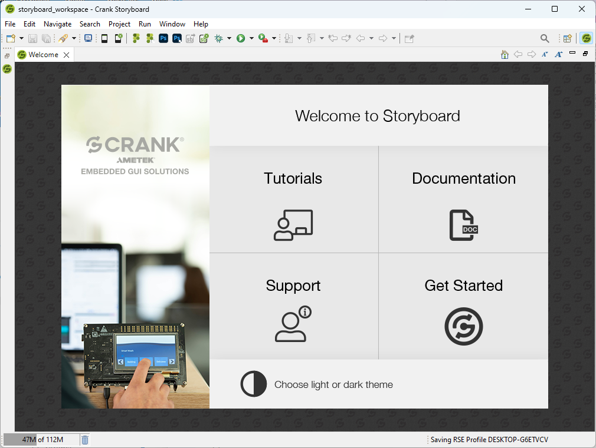
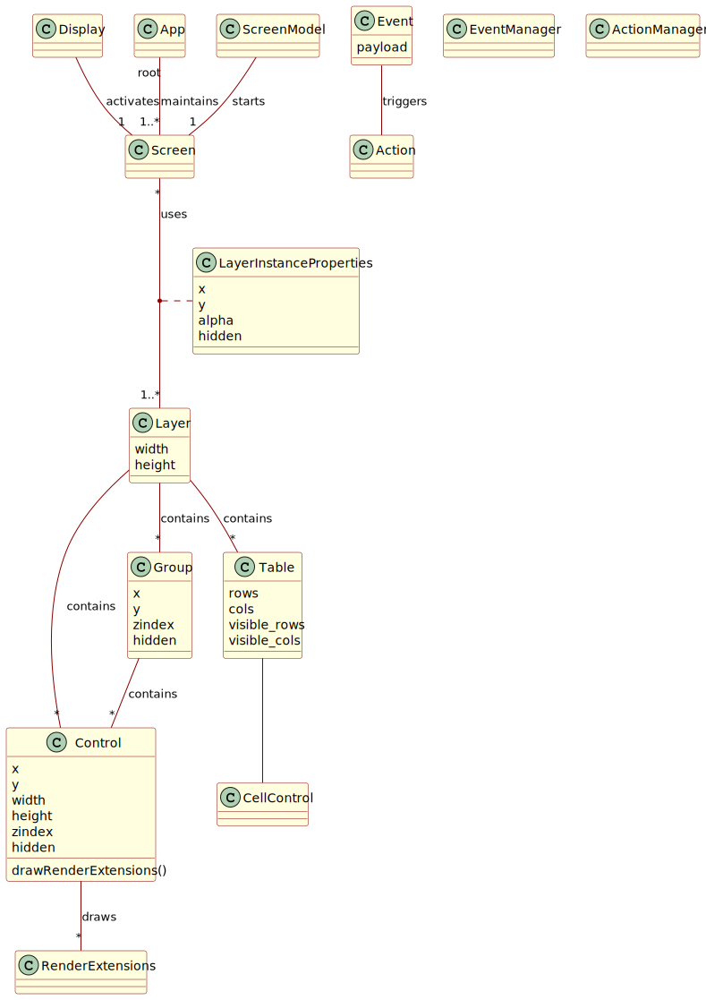

# Cranky Demo

Also available as a [blog post](https://roy.ratcliffe.me/2024/04/28/cranky/).

Suppose that your organisation wants to demonstrate a Crank application early in its development when functional components do not exist---a mock-up user interface. This is not an unusual requirement. Quite normal in fact.

The ideal UI prototyping work prefers a collection of screen images taken from Photoshop or even snapshots taken directly from the screen. Speed and flexibility are the main goals. Human interface experts want to expose elements of the interface to potential customers in a somewhat realistic fashion. The demonstration platform therefore only needs the interface to look like the real thing, not operate as such. No requirements for fancy animations, screen transitions, virtual keyboards, focus changes or any such advanced features of the interface exist. Nor do any functional requirements exist.

Take a very simple embedded systems example. The project's user interface has a rudimentary keypad. It has no touch screen. The interface comprises one non-touch screen and one keypad. The goal is to wire up a user interface that can easily flip between screen mock-ups based on key presses. Since our target is embedded, our UI design tool will be [Crank's Storyboard designer](https://www.cranksoftware.com/) by AMETEK.

## Prerequisites

Download the Storyboard tool from Crank's website. You need a license key. They email a free 30-day trial license. Version $8.1.0$ is the latest at present. After a successful install, the storyboard workspace appears in <a href="#fig-storyboard-workspace" class="quarto-xref">Figure 1</a>.



### Crank Architecture

To begin, an overview of Crank seems appropriate. See <a href="#fig-crank" class="quarto-xref">Figure 2</a> for a class-style unified model. The figure presents only a simplified sketch. The key components, ordered by decreasing significance, are screens, layers and controls.



In UML terms, the model looks 'something' like the figure. The sketch is not complete or exact. It represents an initial conceptual grasp.

Layers turn out to be what you might first think about having used drawing tools like Adobe Photoshop, [GIMP](https://www.gimp.org/) or [InkScape](https://inkscape.org/). They apply a layered stack of overlapping controls presented to the user by bottom-to-top blending on each screen. They have their own life within Crank, however. Screens can share layers.

In software technical nomenclature, layers have a many-to-many association with screens; this linkage appears in <a href="#fig-crank" class="quarto-xref">Figure 2</a> on the association line between *Screen* and *Layer* in the model. Screens effectively reuse layers. Screens share layer instances, not just the template. All layer-sharing screens see the difference if a layer changes.

Groups belong to layers and controls belong to groups but groups cannot contain other groups. The architecture currently disallows the nesting of groups within groups.

Although not shown in the figure, the Crank UI engine equips Lua $5.1$ for scripting.

## Dynamically-Bound Snapshots Using Lua

The solution in a nutshell: use Crank's Lua scripting engine to dynamically bind images to the screen with user-defined key transitions. The solution utilises the scripting environment's Lua loading capabilities. Games use such capabilities.

Find the complete solution on [GitHub](https://github.com/royratcliffe/cranky_demo). It represents a $640\times480$ VGA storyboard application called `cranky_demo`. It comprises a single screen containing a single layer with a single image rendering control---and that represents all the UI real estate. Super simple! Lua does the heavy lifting by loading mock-up images in the background when responding to show-screen and key-press events.

The Screen component carries one string variable called `image` with an initial value of `""`. The Control's `image` property *binds* to this variable. Change the variable and the image property of the Control changes; the component automatically presents the new image.

### Dynamic Lua Environment

An "abstract demo environment" wraps the dynamic image-switching screen.

``` lua
local env = {}

function env:set_screen(screen)
  if screen then
    self.screen = screen
    gre.set_value("Screen.image", self.screens[screen].image)
  end
end

function env:screen_for(transition)
  return transition and self.screens[self.screen][transition]
end
```

It has two methods:

1.  `set_screen` sets the current screen,
2.  `screen_for` finds the screen for a key-based transition.

### Application Initialisation Callback

This is where the moon[^1] magic happens.

At application initialisation time, a call-back function 'loads and runs' an application environment. It dynamically primes the demo environment ready for image transitions.

``` lua
function init_cb(mapargs)
  assert(pcall(setfenv(assert(loadfile(gre.APP_ROOT .. "/env.lua")), env)))
end
```

-   `gre.APP_ROOT` defines the deployment location of the Crank application's root directory.
-   Lua's built-in `setfenv` runs the loaded `env.lua` within the local `env` environment table when invoked using Lua's `pcall` protected-call function.

### Pre-Show and Key-Press Callbacks

Additional callback functions respond to pre-show screen and key-down events, as follows.

``` lua
function pre_show_screen_cb(mapargs)
  env:set_screen(env.screen)
end

function key_down_cb(mapargs)
  local key = mapargs.context_event_data.key
  local transition = env.keys[key]
  print("key_down: " .. (transition or key))
  env:set_screen(env:screen_for(transition))
end
```

For diagnostic purposes, the key-down callback prints either the key transition if found else the raw key code; the UI designer can plug new transitions in using the codes appearing in the log.

## Usage

Within `env.lua` located in the app root folder, the UI designer simply defines the screens, the initial screen and how each useful key code translates to abstract key transitions; in that order, these three requirements appear listed in the following exemplar. Order does not matter. The example illustrates only two screens but no limit exists. Add as many as needed. Their names are also arbitrary. Call them whatever you like.

``` lua
screens = {
  screen1 = {
    image = "images/image1.png",
    right = "screen2" -- transition
  },
  screen2 = {
    image = [[C:\Users\roy.ratcliffe\Pictures\Screenshots\Screenshot.png]],
    left = "screen1" -- transition
  }
}

screen = "screen1"

keys = {
  [37] = "left",
  [38] = "up",
  [39] = "right",
  [40] = "down"
}
```

The `image` defines what image to present on its screen. Its value is a file-system path, either relative to the app root or absolute.

The paths work for any operating system. Lua handles a path's component delimiters in a flexible manner. Use forward slashes or backslashes interchangeably, even alternatively within the same path. Lua does not care. Paths can be absolute. Use the `[[]]` Lua operators to conveniently enclose backslash-delimited paths *without* the need to escape the backslashes using escape---double escapes. Example above.

By defining screens and transitions within the given Lua file, UI designers can more easily bring their visions to life early in the project aiming for seamless, elegant user experiences that strive to please aesthetically. The UI arguably represents the most important piece of any software product. It is the only piece of software with which the end user directly interacts. Users tend to measure the quality of a device by its interface.

## Conclusions

Lua is a flexible language, much as Crank is a flexible UI framework. They belong together.

Note that the technique outlined herein cannot replace a fully-featured production-ready user interface. Real-world interfaces involve much more than image switching. However, our goal was to provide a simple mock-up interface for user evaluation during the early product design phase.

The Crank UI system is very powerful. It gives the developer more than enough to shoot himself in the foot, if not careful.

> "You see, in this world, there's two kinds of people, my friend: Those with loaded guns and those who dig. You dig."---The Good, the Bad and the Ugly

[^1]: Lua translates 'moon' in Portuguese
